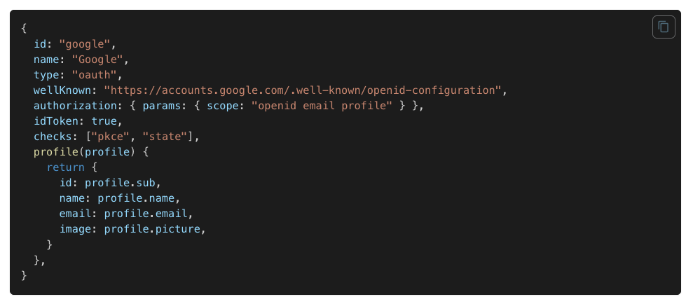

# 🙃 Why Next-auth?

## 비밀번호 없는 로그인

Next.js는 Serverless를 지원하도록 처음부터 설계되었습니다. 모든 OAuth 서비스와 동기화하도록 설계되었으며 데이터터베이스 유무에 관계없이 사용할 수 있으며 MySQL, MongoDB, PostgreSQL 및 MariaDB와 같은 인기 있는 데이터베이스에 대한 기본 지원이 있습니다. 데이터베이스로 세션 유지를 하거나 JWT로 인증하는 방법 둘다 지원합니다.

## 쉬운 개발

20줄이면 인증과정부터 사용자의 정보를 React-hooks로 사용할 수 있습니다. `SessionProvider` 를 통해 Context를 하위 컴포넌트에서 공유할수도 있습니다.

## 보안 제공

기본적으로 사용자의 데이터를 보호하기 위해 민감한 정보는 저장하지 않도록 설계되어 있습니다.

또한 로그인과 로그아웃 요청 시에도 내부에서 CSRF 토큰을 활용해 사용자의 요청을 검증합니다.

- CSRF 토큰 **(Cross Site Request Forgery)**
  [크로스 사이트 요청 위조(CSRF)의 의미](https://nordvpn.com/ko/blog/csrf/)

  CSRF란 사용자의 컴퓨터에 특정 도메인에 대한 세션 쿠키나 JWT가 저장되어있을 때 공격을 당해 자신의 의사와 상관없이 도메인에서 계좌이체를 하거나 블로그에 글을 올리게 되는 등의 공격을 이야기합니다.
  CSRF 토큰은 이를 위해 구현되었습니다. 사용자의 매 요청마다 임의의 난수값을 주는데 탈취된 세션이더라도 CSRF 토큰이 이전에 이미 완료된 요청의 토큰이라면 그 해당 세션을 모두 정지시키는 방식입니다.

# 📕 Configuration

## 1. **Provider**

```ts
CredentialsProvider({
	name: "Credentials",
	credentials: {
		username: { label: "Username", type: "text", placeholder: "jsmith" },
		password: { label: "Password", type: "password" },
	},
	async authorize(credentials, req) {
		const res = await fetch("/your/endpoint", {
			method: "POST",
			body: JSON.stringify(credentials),
			headers: { "Content-Type": "application/json" },
		});
		const user = await res.json();

		if (res.ok && user) {
			return user;
		}

		return null;
	},
});
```

OAuth, Email, Credentials Provider가 있습니다. OAuth, Email의 경우에는 인증 후 치뤄지는 Response를 해당 어플리케이션에서 주지만 Credentials의 경우에는 인증 성공후 리스폰스를 해당 도메인에서 줄 수 있습니다.



예를 들어 구글같은 경우에는 OAuth 인증 후 session 정보를 보면 해당 리스폰스가 담긴 것을 확인할 수 있습니다.

### 옵션

| Name        | Description                                       | Type                                | Required |
| ----------- | ------------------------------------------------- | ----------------------------------- | -------- |
| id          | Unique ID for the provider                        | string                              | Yes      |
| name        | Descriptive name for the provider                 | string                              | Yes      |
| type        | Type of provider, in this case credentials        | "credentials"                       | Yes      |
| credentials | The credentials to sign-in with                   | Object                              | Yes      |
| authorize   | Callback to execute once user is to be authorized | (credentials, req) => Promise<User> | Yes      |

- `credentials`

  ```ts
  export interface CredentialInput {
      label?: string;
      type?: string;
      value?: string;
      placeholder?: string;
  }

  ...
  credentials: {
    address: {}, // address: CredentialInput
    loginType: {}
  },
  ...
  ```

  Next-auth에서 인증을 하는 양식을 정하는 옵션입니다. credentials의 키 값들로 Next-auth는 로그인을 처리합니다.
  credentials의 키들이 `CredentialInput` 타입인 이유는 submit 이벤트가 발생할 것으로 예상되는 input의 field를 미리 타이핑했기 때문인데요. 사용하지 않아도 되는 옵션입니다.

  ```ts
  signIn("credentials", {
  	address,
  	loginType: LOGIN_TYPES.KAIKAS,
  	callbackUrl: MAIN_PATH.PROJECT("klaytn"),
  	redirect: false,
  });
  ```

  이제 next-auth의 로그인 메소드를 호출할 때 해당 키 value들과 추가 옵션을 넣으면 인증이 구현됩니다.

- `authorize`
  ```ts
  async authorize(credentials) {
    if (!credentials) return null
    const response = await setLogin(credentials?.address)
    return {
      id: new Date().getTime(),
      ...response,
      loginType: credentials?.loginType
    }
  }
  ```
  이제 SignIn 메소드가 호출되면 우리는 session에 어떤 정보를 담을지 콜백을 넘겨줄 수 있습니다. 해당 콜백에서 DB의 user 정보를 조회하거나 백엔드 서버에서 access token을 받아오는 등의 조치를 취할 수 있습니다.
  ```ts
  [Object: null prototype] {
    address: '...',
    callbackUrl: '/',
    csrfToken: '...',
    json: 'true'
  }
  ```
  인자값으로 들어오는 credentials에는 next-auth가 signIn에서 받아온 키 값들과 자체로 생산한 csrf 토큰이 같이 들어있습니다.

## 2. Secret & Debug

```ts
...
secret: process.env.AUTH_SECRET,
debug: process.env.NODE_ENV === 'development',
...
```

- secret
  secret에 들어가는 임의 문자열은 토큰을 해시하고 쿠키를 서명/암호화하며 암호화 키를 생성하는 데 사용됩니다.

      ```ts
      const session = require('express-session');
      const cookieParser = require('cookie-parser');

      app.use(cookieParser(process.env.COOKIE_SECRET));
      app.use(session({
          saveUninitialized: false,
          resave: false,
          secret: process.env.COOKIE_SECRET
      }));
      ```

      express에서 인증을 구현할 때 쓰이는 임의 문자열과 똑같은 역할입니다.

- debug
  디버그 메시지를 사용하고 싶을 때 true로 줍니다.

## 3. session & jwt

```ts
...
session: {
	strategy: "database",
	maxAge: 30 * 24 * 60 * 60, // 30 days
},
jwt: {
  maxAge: 60 * 60
},
...
```

- `session`
  사용자의 세션을 어떻게 관리할지 여러가지 추가 옵션이 있습니다. strategy의 기본값은 암호화된 JWT(JWE)를 세션 쿠키에 저장하는 방식인 `“jwt”`입니다. maxAge로 만료시간등을 설정할 수 있습니다.
- `jwt`
  jwt의 경우 session의 전략을 default로 했을 시 토큰을 인코딩하는 과정에 알고리즘이나 로직을 추가적으로 설정할 수 있습니다. maxAge의 경우 기본값이 session의 maxAge로 되어있기 때문에 추가 고급옵션을 쓰지 않을 경우 **이 옵션 자체를 따로 쓸 필요가 없습니다.**

## 4. callback

```ts
...
callbacks: {
	async session({ session, token }) {
    if (session && session.user) {
      session = {
        ...session,
        user: { ...session.user, ...token }
      }
      return session
    }
    return session
  },
  async jwt({ token, user, account }) {
    if (account && user) {
      return {
        ...token,
        ...user
      }
    }
    return token
  }
},
...
```

- session callback
  사용자가 useSession이나 getSession 등 기존 저장된 세션정보를 확인하려 할 때 호출됩니다. next-auth가 authorize한 이후로 **보안 강화를 위해 토큰의 하위 집합만 반환**하기 때문에 여기서 명시적으로 담는 과정이 필요합니다.

  ````ts
  async session({ session, token, user }) {
  session.accessToken = token.accessToken
  session.user.id = token.id

          return session
      }
      ```

  ````

- jwt callback
  이 콜백은 JSON 웹 토큰이 생성되거나(즉, 로그인할 때) 업데이트될 때마다(즉, 클라이언트에서 세션에 액세스할 때마다) 호출됩니다. 반환된 값은 **[암호화](https://next-auth.js.org/configuration/options#jwt)** 되어 쿠키에 저장됩니다.
  세션이 활성상태일 때마다 토큰 만료 시간이 연장됩니다. ⇒ 기존 로그아웃하지 않고 브라우저 나갔을 시 쿠키에 심어져있다 다시 들어왔을 때 세션이 활성화되어 토큰 시간이 연장된 것을 볼 수 있습니다.

  ```ts
  async jwt({ token, account, profile }) {
    if (account) {
      token.accessToken = account.access_token token.id = profile.id
      }
      return token
  }
  ```

# 🐞 Error case

[Frequently Asked Questions | NextAuth.js](https://next-auth.js.org/v3/faq)

- JSON 웹 토큰에는 저장할 수 있는 데이터 양이 제한됩니다. 일반적으로 쿠키 용량이 4096byte이기 때문에 authorize할 때 세션에 너무 많은 정보를 담으면 인증자체가 안될 수 있습니다.
