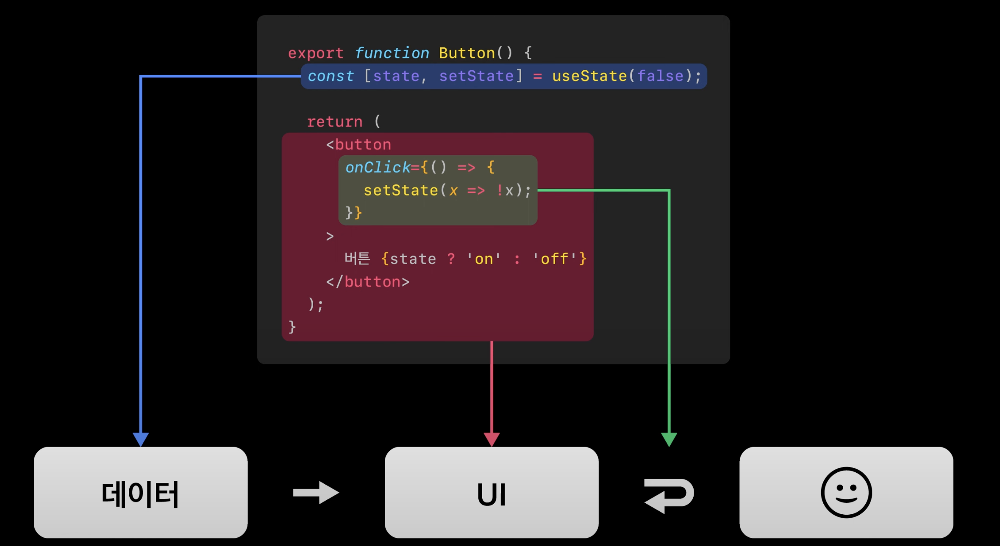
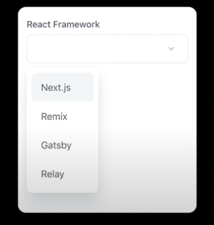
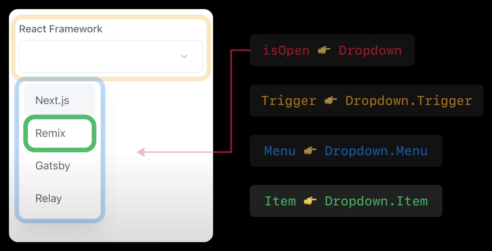

# 토스에서 보는 분리 요소 3가지

> 토스ㅣSLASH 22 - Effective Component 지속 가능한 성장과 컴포넌트

1. Headless 기반의 추상화

- 변하는 것과 변하지 않는 것

2. 한 가지 역할만 하기

- 또는 한가지의 역할만 하는 컴포넌트로 조합해서 구성하기

3. 도메인 분리하기

- 도메인을 포함하는 컴포넌트와 그렇지 않은 컴포넌트 분리하기

<br />

# 1. Headless 기반의 추상화



<br />

## `데이터 추상화`

```tsx
const Calendar = () => {
	const { headers, body } = useCalendar();
	// 달력 데이터에 관한 계산이나 read는 hooks로 분리

	return (
		// JSX에서는 순수하게 UI와 렌더링만
		<table>
			<thead>
				<tr>
					{headers.map((v, i) => (
						<th key={v + i}>{v}</th>
					))}
				</tr>
			</thead>
			<tbody>
				<tr>
					{body.map((v) => {
						return <td>{v}</td>;
					})}
				</tr>
			</tbody>
		</table>
	);
};

export default Calendar;
```

위 코드처럼 한 컴포넌트에서도 데이터에만 집중해서 그 부분을 모듈화하고 UI를 관심사에서 분리할 수 있다.

이런 패턴을 Headless라고 표현한다.

<br />

## `동작 추상화`

```tsx
function useAmazingButton() {
	return {
		onKeyDown: (e: React.KeyboardEvent) => console.log("onKeyDown"),
		onKeyUp: (e: React.KeyboardEvent) => console.log("onKeyUp"),
		onMouseDown: (e: React.MouseEvent) => console.log("onMouseDown"),
		onCilck: (e: React.MouseEvent) => console.log("onCilck"),
	};
}

const AmazingButton = () => {
	const amazingProps = useAmazingButton();

	return <Button {...amazingProps} />;
};

export default AmazingButton;
```

이번에도 hooks로 해당 동작들을 모듈화했다. 앞으로도 해당 액션들이 필요할 때는 어디서든 쓸 수 있을 것이다.

<br />

# 2. 한 가지 역할만 하기 [`Composition`]



Select UI를 구현한 모습입니다. 아래 코드를 보시면 여러 동작들이 종속되어서 변경에 대처하기가 힘든데요.

```tsx
const RFselect = () => {
	const [isOpen, open, close] = useBoolean();
	const [selected, change] = useState("");
	const {
		data: { frameworks: options },
	} = useFrameworks();

	return (
		<div>
			// 다른 컴포넌트로 변경해야되거나 label을 바꿔야되는 등 // 컴포넌트 채로
			새로 작성해야 하는 번거로움이 있다.
			<InputButton label='React Framework' value={selected} onClick={open} />
			{isOpen && (
				<Options onClick={close}>
					{options.map((option) => {
						return (
							<Button
								selected={selected === option}
								onClick={() => change(option)}
							>
								{option}
							</Button>
						);
					})}
				</Options>
			)}
		</div>
	);
};
```



해당 UI를 역할을 나눠서 각자 변경하는 일이 있더라도 같은 역할을 수행할 수 있게

분리해봅시다.

```tsx
function Select({ label, trigger, value, onChange, options }) {
	return (
		<Dropdown label={label} value={value} onChange={onChange}>
			<Dropdown.Trigger as={trigger} />
			<Dropdown.Menu>
				{options.map((option: any) => (
					<Dropdown.Item>{option}</Dropdown.Item>
				))}
			</Dropdown.Menu>
		</Dropdown>
	);
}
```

1. 메뉴가 열리고 닫는 상태를 가진 역할 => isOpen / Dropdown 컴포넌트로 부여

2. 상태를 바꾸기 위한 상호작용 역할 => Trigger 컴포넌트로 부여

3. 열고 닫힌 상태에 따라 노출여부가 결정되는 역할 => Menu 컴포넌트로 부여

4. 메뉴를 구성하는 각각의 아이템 + 상호작용 역할 => Item 컴포넌트로 부여

이제 완성된 Select 컴포넌트로 언제든 재사용가능해졌습니다.

```tsx
const FrameworkSelect = () => {
	const {
		data: { frameworks },
	} = useFrameworks();

	const [selected, onChange] = useState("");

	return (
		<Select
			label='React FrameWork'
			trigger={<InputButton value={selected} />}
			// trigger가 언제 변경되더라도 문제가 없다.
			options={frameworks}
			value={selected}
			onChange={onChange}
		/>
	);
};

export default FrameworkSelect;
```
