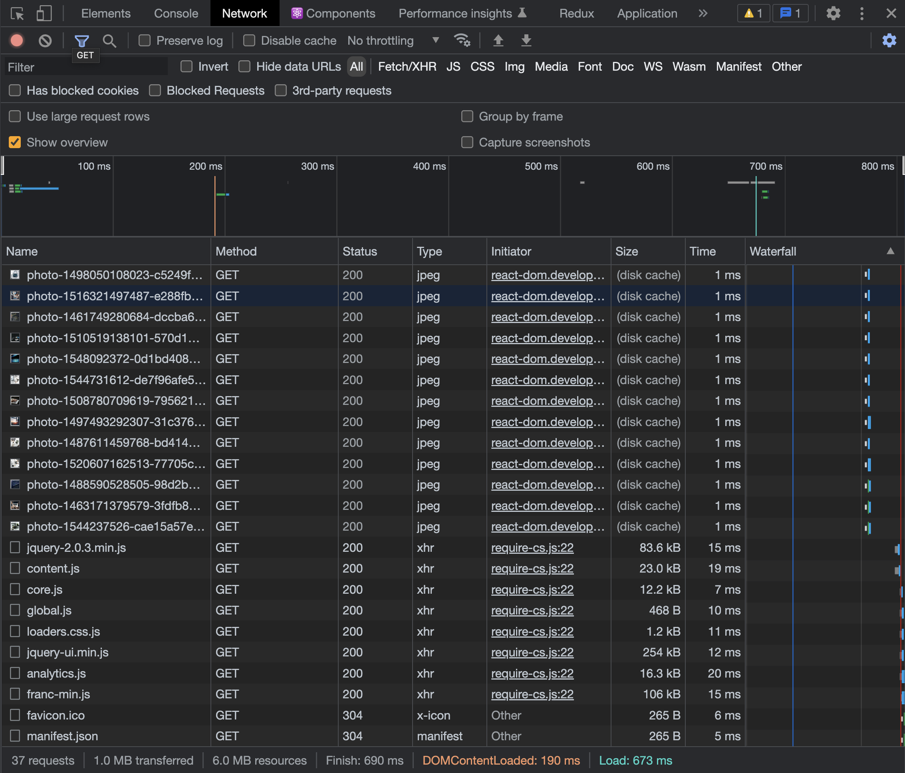
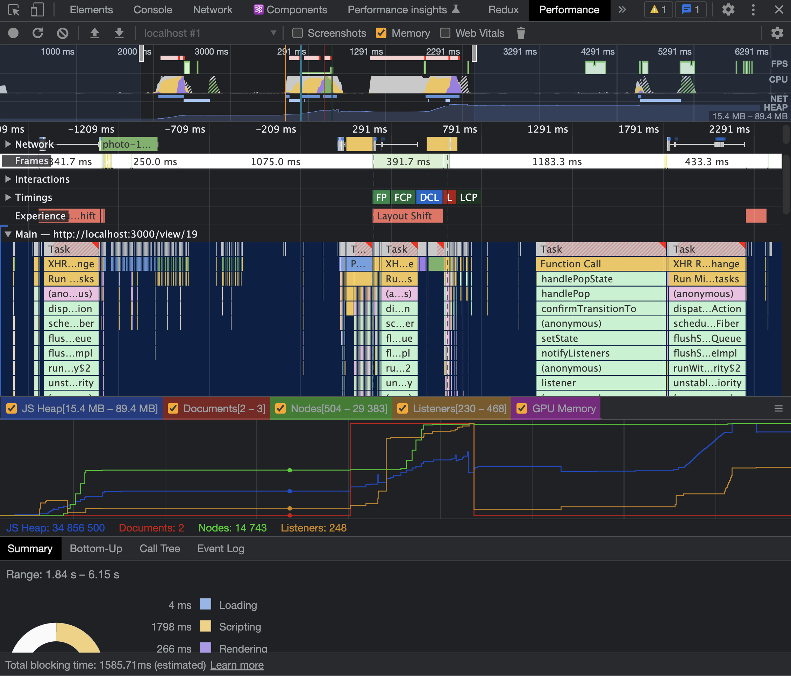

# 프론트엔드를 위한 최적화

# `웹 성능 최적화는 왜 필요할까?`

## 1. 사용자가 떠나지 않도록 하기 위해 => 수익증대

    리소스를 요청하는 과정에서 시간이 많이 걸린다면 사용자는 이 과정을 견디기 힘들어진다. 성능이 좋아서 사용자가 서비스에 머무르는 시간이 길어진다면 수익으로 이어진다.

## 2. 프론트엔드 개발자로서 경쟁력이 생긴다.

 

# `웹 성능 결정 요소`

크게 두가지로 볼 수 있다.

## 1. 로딩 성능

    => 어떻게 더 빠르게 로드할지
    html, css, js, img, mp4 등 각 리소스들을 가져오는 과정.

## 2. 렌더링 성능

    => 어떻게 더 빠르게 렌더링할 것인지
     가져온 html + css + js를 화면에 그려주는 과정.

 

# `대표적인 분석 툴`

## 1. Chrome - Network Tab

    네트워크 요청들에 관한 상세 정보 탭

 

## 2. Chrome - Lighthouse Tab

    서비스가 성능적으로 어느정도 수준인지 판단해주고 개선 가이드라인도 제공해주는 탭

 

## 3. Chrome - Performance Tab

    웹페이지가 동작할 때 실행되는 모든 작업들을 그래프로 시각화해서 보여주는 탭

 

## 4. webpack-bundle-anaylazer

    웹팩을 통해서 번들링된 파일들을 시각화해서 보여주는 툴.

 

## 5. React Dev Tools - Profiler

    Profiler는 React 애플리케이션이 렌더링하는 빈도와 렌더링 “비용”을 측정합니다.
    Profiler의 목적은 메모이제이션 같은 성능 최적화 방법을 활용할 수 있는 애플리케이션의 느린 부분들을 식별해내는 것입니다.
    - React

 

#
