# 프론트엔드를 위한 최적화

# `웹 성능 최적화는 왜 필요할까?`

## 1. 사용자가 떠나지 않도록 하기 위해 => 수익증대

    리소스를 요청하는 과정에서 시간이 많이 걸린다면 사용자는 이 과정을 견디기 힘들어진다. 성능이 좋아서 사용자가 서비스에 머무르는 시간이 길어진다면 수익으로 이어진다.

## 2. 프론트엔드 개발자로서 경쟁력이 생긴다.

<br />

# `웹 성능 결정 요소`

크게 두가지로 볼 수 있다.

## 1. 로딩 성능

    => 어떻게 더 빠르게 로드할지
    html, css, js, img, mp4 등 각 리소스들을 가져오는 과정.

## 2. 렌더링 성능

    => 어떻게 더 빠르게 렌더링할 것인지
     가져온 html + css + js를 화면에 그려주는 과정.

<br />

# `대표적인 분석 툴`

## 1. Chrome - Network Tab

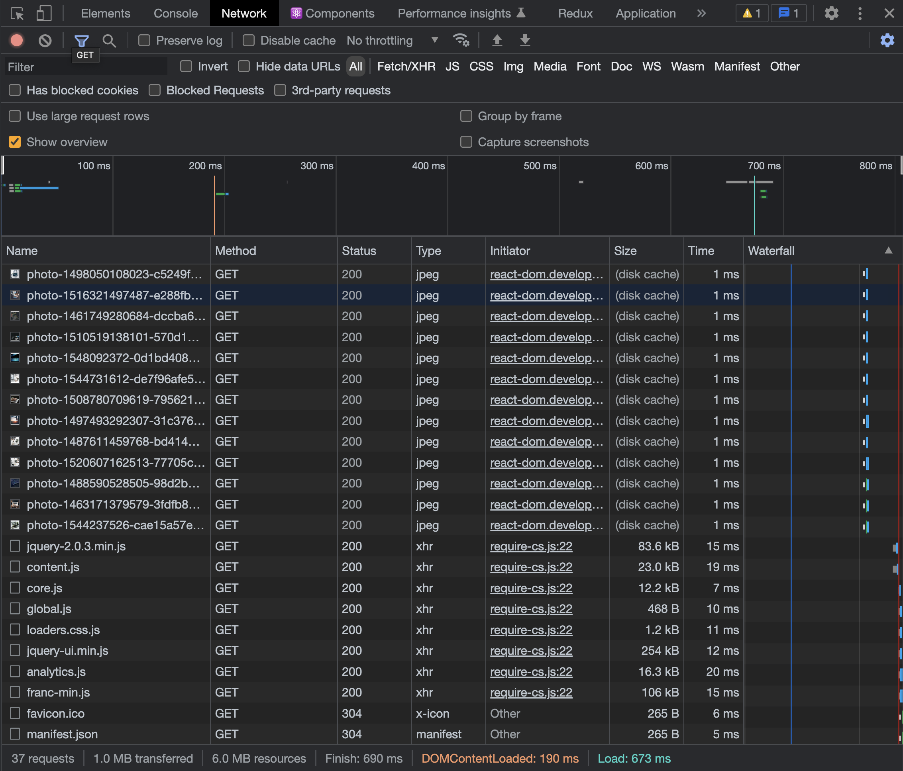

    네트워크 요청들에 관한 상세 정보 탭

<br />

## 2. Chrome - Lighthouse Tab

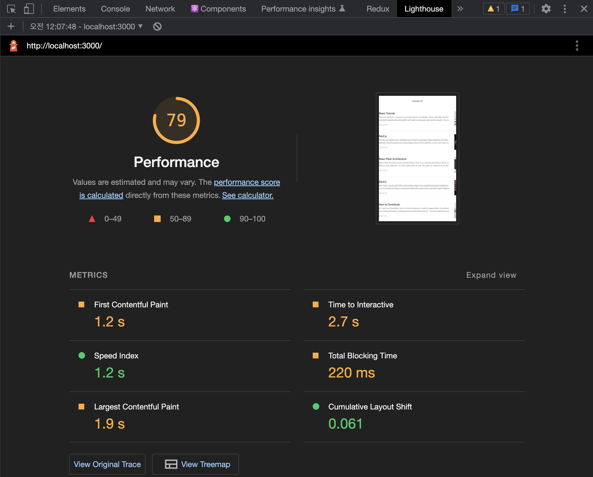

    서비스가 성능적으로 어느정도 수준인지 판단해주고 개선 가이드라인도 제공해주는 탭

<br />

## 3. Chrome - Performance Tab

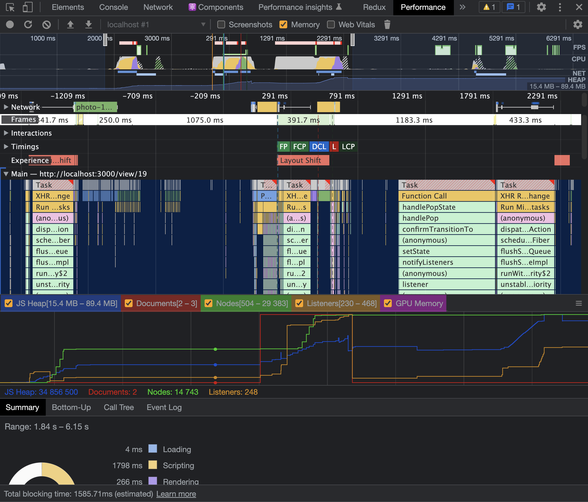

    웹페이지가 동작할 때 실행되는 모든 작업들을 그래프로 시각화해서 보여주는 탭

<br />

## 4. webpack-bundle-anaylazer

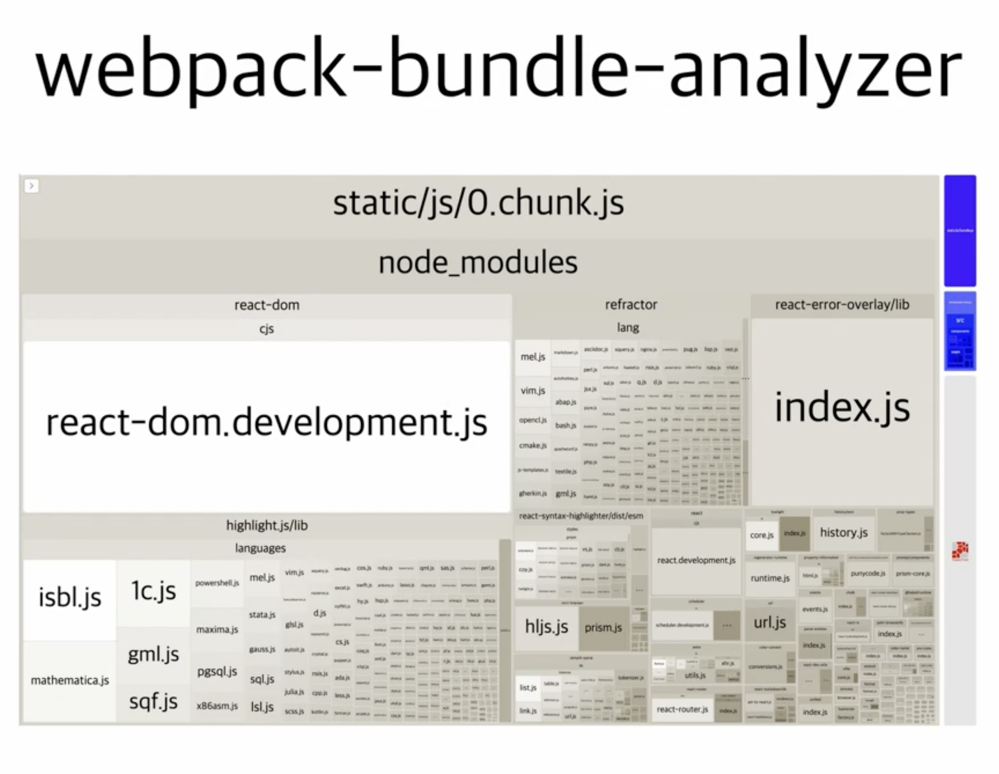

    웹팩을 통해서 번들링된 파일들을 시각화해서 보여주는 툴.

<br />

## 5. React Dev Tools - Profiler

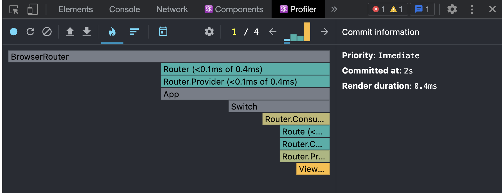

    Profiler는 React 애플리케이션이 렌더링하는 빈도와 렌더링 “비용”을 측정합니다.
    Profiler의 목적은 메모이제이션 같은 성능 최적화 방법을 활용할 수 있는 애플리케이션의 느린 부분들을 식별해내는 것입니다.
    - React

<br />

# `최적화`

## `Image Optimze`

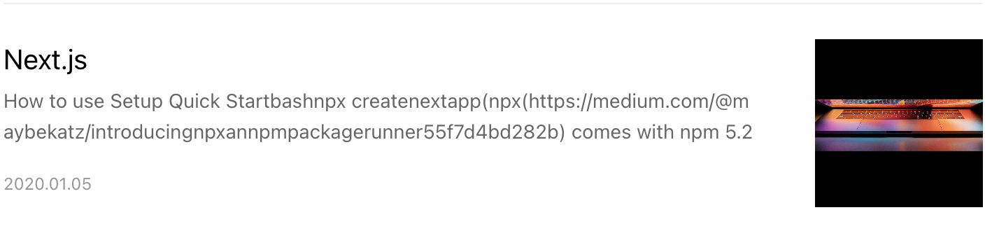

api를 통해서 제목, 설명, 이미지를 렌더링하는 컴포넌트가 있습니다.

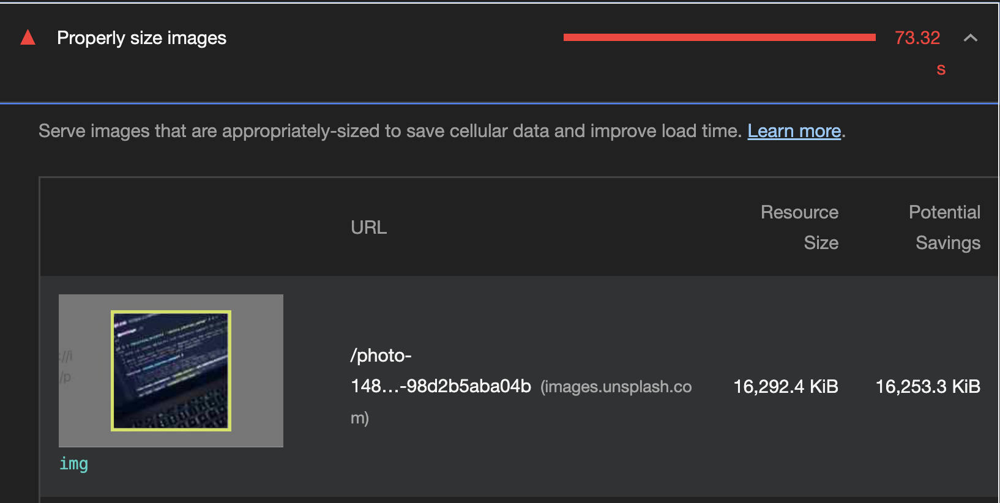

lighthouse를 통해서 확인해보면 이린 메세지를 확인할 수 있는데요.

실제 보여주는 이미지의 사이즈에 비해 불러오는 리소스의 용량이 너무 크다는 문구입니다.

실제로 보여줄건 100px * 100px인데 불러온 사진의 크기는 1024*1024입니다.

이런 문제때문에 `이미지 리사이징`은 웹에서 중요한 문제입니다.

**원본 소스를 서버에서 적절하게 압축해서 보내주면 클라이언트에서 리소스를 받는 속도가 더욱 빨라질 것입니다.**

이미지 리사이징을 지원하는 API나 CDN을 활용해서 해결할 수 있습니다.

<br/>

## `IMAGE processing CDN`이란?

이미지를 사용자에게 보내기 전에 사이즈를 줄이거나 format을 바꾸는 처리과정을

거쳐서 사용자에게 보내주는 CDN입니다.

클라우드플레어, 클라우드프론트 등이 있습니다.

```html
http://cdn.image?src=[img SRC]&width=200&height=100`
```

## `Bottleneck 해결방안`

    병목(bottleneck) 현상은 전체 시스템의 성능이나 용량이 하나의 구성 요소로 인해 제한을 받는 현상을 말한다.

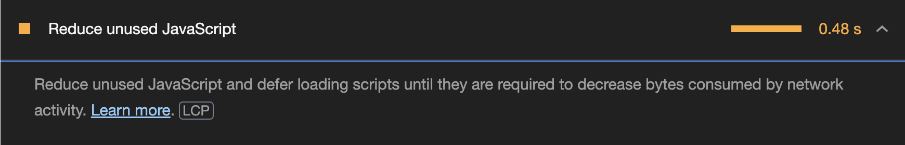

이번에는 라이트하우스 탭에서 사용하지 않는 함수를 줄여라라는 항목을 발견했는데요.

어떤 스크립트가 문제인지는 번들링되어 확인하기 힘들기 때문에 퍼포먼스 탭을 활용해야 합니다.

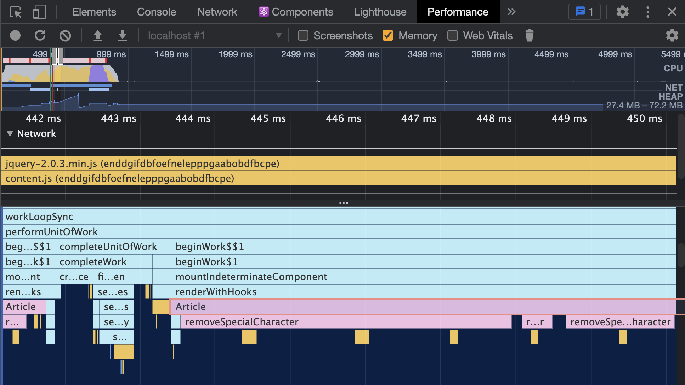

Performance 탭에서는 문서를 로드하는 과정부터 스크립트들이 실행되는 과정을 눈으로 확인할 수 있습니다.

현재 Article이란 컴포넌트가 굉장히 오랫동안 실행되는 것을 확인할 수 있는데요.

```js
/*
 * 파라미터로 넘어온 문자열에서 일부 특수문자를 제거하는 함수
 * (Markdown으로 된 문자열의 특수문자를 제거하기 위함)
 * */
function removeSpecialCharacter(str) {
	const removeCharacters = [
		"#",
		"_",
		"*",
		"~",
		"&",
		";",
		"!",
		"[",
		"]",
		"`",
		">",
		"\n",
		"=",
		"-",
	];
	let _str = str;
	let i = 0,
		j = 0;

	for (i = 0; i < removeCharacters.length; i++) {
		j = 0;
		while (j < _str.length) {
			if (_str[j] === removeCharacters[i]) {
				_str = _str.substring(0, j).concat(_str.substring(j + 1));
				continue;
			}
			j++;
		}
	}

	return _str;
}
```

Article 컴포넌트안에는 이런 함수가 실행되고 있었다.

우리가 할 수 있는 방법들은

- 특수 문자를 효율적으로 제거하기

  - replace 함수와 정규식 사용
  - 라이브러리를 쓰기

- 작업하는 양 줄이기

```js
function removeSpecialCharacter(str) {
	let _str = str.substring(0, 300); // 컴포넌트에서 보여줄 문자만 자르고

	str = _str.replace(/[\#\_\*\~\&\;\~\[\]\`\n\=\-]/g, ""); // 정규표현식으로 줄엿다

	return _str;
}
```

## `Code Spliting`

덩치가 큰 번들사이즈의 모듈들을 줄이는 것, 예를 들어 처음 메인페이지에서는 필요없는 라이브러리를

제외해주는 과정이 필요하다. 페이지 단위로 필요한 모듈만 뭉쳐서 번들링하는 것이

처음 로드할 리소스를 더 줄여줄 것이다.

https://ko.reactjs.org/docs/code-splitting.html

```zsh
yarn add -D cra-bundle-anaylzer
```

```jsx
import React, { lazy, Suspense } from "react";
import { Switch, Route } from "react-router-dom";
import "./App.css";

const ListPage = lazy(() => import("./pages/ListPage/index"));
const ViewPage = lazy(() => import("./pages/ViewPage/index"));

function App() {
	return (
		<div className='App'>
			<Suspense fallback={<div>Loading...</div>}>
				<Switch>
					<Route path='/' component={ListPage} exact />
					<Route path='/view/:id' component={ViewPage} exact />
				</Switch>
			</Suspense>
		</div>
	);
}

export default App;
```

분리 전과 분리 후 번들링이 바뀐 것을 확인할 수 있다.

## `텍스트 압축`

```zsh
Content-Encoding: gzip
```

html,css,js의 텍스트들을 압축해서 서버가 보내주면 우리는 빨리 로드할 수 있다.

서버에서 압축하면 클라이언트에서 그파일을 압축해제하는 과정이 필요한데

2kb 이상인 파일이면 압축해주는 게 좋고 그 이하면 하지 않는게 오히려 성능에 좋을 수 있다.

<br />

## `animation 최적화`

브라우저는 초당 60 frame으로 화면을 그린다. 그러나 어떤 이유로 초당 frame이 떨어지면

쟁크 현상이 생긴다.(애니메이션이 버벅인다)

보통 브라우저의 렌더링 과정을 짧은 시간안에 많이 반복하기 때문에 성능 저하로 인한 쟁크 현상이 생긴다.

    브라우저의 렌더링 과정
    DOM+CSSOM => Render Tree => Layout => Paint => Composite

- [width, height] : 모든 과정이 다시 재실행된다. (`Reflow`)
- [color, background-color] : Layout 과정이 생략된다 (`Repaint`)
- [transform, opacity] : Reflow와 Repaint를 피하기 위해 `GPU`의 도움을 받는다. (Layout, Paint 과정 둘다 생략)

<br/>

## `LazyLoading`의 단점

처음 전체 리소스를 불러올 때는 리소스가 줄어 속도가 빨라졌지만

클릭한 순간 모듈을 불러올 때 실제로 코드가 실행되는 순간은 오히려 더 느려질 수 있다.

이럴 때 필요해지기 전에 미리 로드해놓는 것을 `Preload`라고 한다.

<br/>

## `PreLoad`

클릭을 예로 들면 타이밍은 버튼 위에 마우스를 올려놨을때로 볼 수 있다.

```tsx
import React, { Suspense, useState, lazy } from "react";
const LazyImageModal = lazy(() => import("./components/ImageModal"));

function App() {
	const [showModal, setShowModal] = useState(false);

	const handleMouseEnter = () => {
		const component = import("./components/ImageModal");
	};

	return (
		<>
			<ButtonModal
				onMouseEnter={handleMouseEnter}
				onClick={() => {
					setShowModal(true);
				}}
			>
				올림픽 사진 보기
			</ButtonModal>

			<Suspense fallback={null}>
				{showModal ? (
					<LazyImageModal
						closeModal={() => {
							setShowModal(false);
						}}
					/>
				) : null}
			</Suspense>
		</>
	);
}
```

만약 모듈이 생각보다 무거워 짧은 시간안에는 무리가 있다면

최초 페이지 로드가 되고 마운트가 끝났을 때 Preload하는 것도 괜찮다.

```tsx
import React, { Suspense, useState, lazy, useEffect } from "react";
const LazyImageModal = lazy(() => import("./components/ImageModal"));

function App() {
	const [showModal, setShowModal] = useState(false);

	useEffect(() => {
		const component = import("./components/ImageModal");
	}, []);

	return (
		<>
			<ButtonModal
				onClick={() => {
					setShowModal(true);
				}}
			>
				올림픽 사진 보기
			</ButtonModal>

			<Suspense fallback={null}>
				{showModal ? (
					<LazyImageModal
						closeModal={() => {
							setShowModal(false);
						}}
					/>
				) : null}
			</Suspense>
		</>
	);
}
```

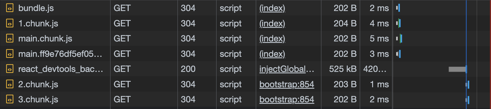

첫 번들링된 청크를 부르고 후에 2,3 청크를 로드하는 걸 확인할 수 있다.

## `Image Preload`

```tsx
const img = new Image();
img.src =
	"https://stillmed.olympic.org/media/Photos/2016/08/20/part-1/20-08-2016-Football-Men-01.jpg?interpolation=lanczos-none&resize=*:800";
```

마운트가 끝나고 이미지 객체를 활용해 미리 로드하고 캐싱된 이미지로 리소스를 불러오게 할 수 있다.

```zsh
cache-control: private, max-age=1501
```

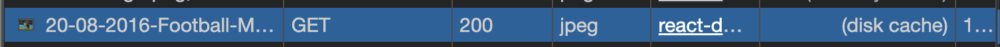

(disk cache)라는 문구를 확인할 수 있다.
