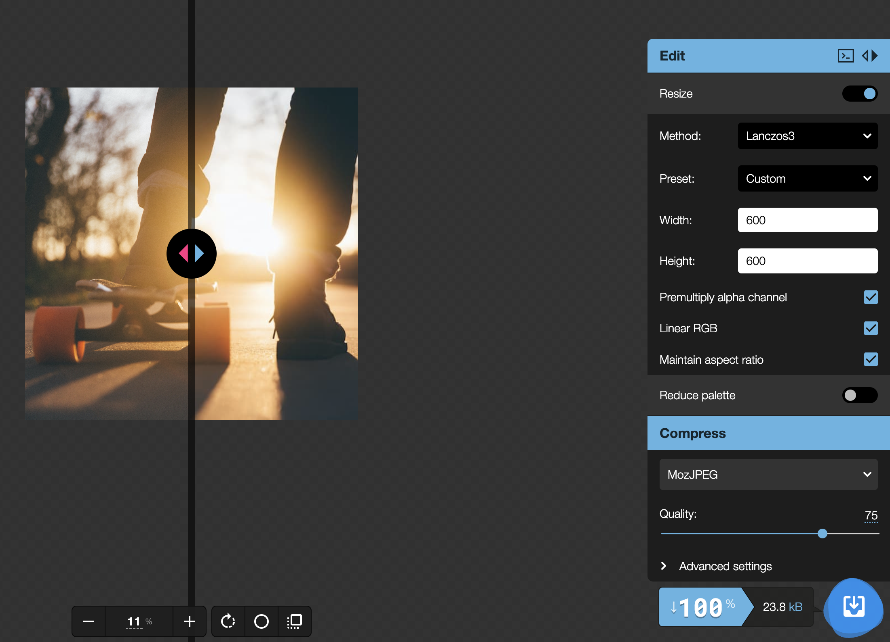

# 프론트엔드를 위한 최적화2

# `이미지 지연 로딩`


## 문제 상황

해당 도메인에서는 처음으로 보는 화면이 비디오 백그라운드와 문구입니다. 그렇다면 무엇보다 비디오를 제일 먼저 로드해야될 것 같은데요.

실제로는 이미지가 모두 로드 되기전까지 비디오 리소스는 Pending 상태에 있는 것을 확인할 수 있습니다.

방법으로는 두 가지가 있습니다.

- 이미지를 `빠르게` download
- 이미지를 `나중에` download, 동영상을 먼저 download

<br />

## `Intersection Observer`

그렇다면 이미지를 언제 부르는게 좋을까요?

스크롤의 위치가 해당 화면에서 이미지가 노출되는 순간이면 그때가 되서야 이미지 레이지로드를 하는 방법도 있습니다.

그러나 단점으로는 매 스크롤마다 함수가 호출한다는 건데요.

Intersection Observer라는 WEB API를 활용해 매 스크롤마다 호출하는게 아닌 실제로 Element가 화면에 보여질때만 호출하게 설정할 수 있습니다.

```js
function Card(props) {
	const imgRef = useRef();

	useEffect(() => {
		const options = {};
		const callback = (entries, observer) => {
			entries.forEach((entry) => {
				if (entry.isIntersecting) {
					console.log("is Intersecting");
					entry.target.src = entry.target.dataset.src;
				}
			});
		};

		const observer = new IntersectionObserver(callback, options);
		observer.observe(imgRef.current);
	}, []);

	return (
		<div className='Card text-center'>
			
			<div className='p-5 font-semibold text-gray-700 text-xl md:text-lg lg:text-xl keep-all'>
				{props.children}
			</div>
		</div>
	);
}
```

화면에 호출되는 순간(`isIntersecting`) src에 리소스 url을 넣어 리소스를 요청하게 했습니다.

이제 비디오가 제일 먼저 요청되고 이미지들은 lazyload 처리가 되어있는 것을 확인할 수 있습니다.

<br/>

# `이미지 최적화`


## 문제 상황

이미지를 지연 로딩하는 데는 성공했지만 이미지 자체가 커서 느린 문제는 해결되지 않았습니다.

## `이미지 포멧`

- PNG: 투명한 백그라운드가 필요하거나 화질이 높은 것을 원할 때
- JPG: 압축률이 높아지지만 비교적 화질이 낮아짐
- WEBP: 구글에서 만든 포멧으로 JPG의 용량과 PNG의 화질을 보장 (다만 지원되지 않는 브라우저 존재)

## `이미지 변환하기`



이미지 CDN API에서 URL의 파라미터로 사이즈를 명시해 리사이징해서 로드하는 방법이 있었고요.

이번에는 로컬의 이미지이기 때문에 https://squoosh.app/ 에서 컨버트를 해서 assets으로 관리하겠습니다.


7MB에서 14.9kb로 훨씬 로드속도가 빨라졌습니다.

## `<picture>`

```jsx
function Card(props) {
	const imgRef = useRef();

	useEffect(() => {
		const options = {};
		const callback = (entries, observer) => {
			entries.forEach((entry) => {
				if (entry.isIntersecting) {
					const target = entry.target;
					const previousEl = target.previousSibling;
					console.log("is Intersecting");
					target.src = target.dataset.src;
					previousEl.srcset = previousEl.dataset.src;
					observer.unobserve(entry.target);
				}
			});
		};

		const observer = new IntersectionObserver(callback, options);
		observer.observe(imgRef.current);
	}, []);

	return (
		<div className='Card text-center'>
			<picture>
				<source data-src={props.webp} srcSet={props.webp} type='image/webp' />
				
			</picture>
			<div className='p-5 font-semibold text-gray-700 text-xl md:text-lg lg:text-xl keep-all'>
				{props.children}
			</div>
		</div>
	);
}
```

용량이 엄청나게 줄었지만 아쉽게도 Webp는 모든 브라우저에서 지원하지 않습니다. 그래서 `<picture>` 태그를 활용해 브라우저마다 분기처리를 해줍시다.

picture 태그의 source가 제대로 렌더링이 된다면 img 태그는 나타나지 않을 것입니다.
