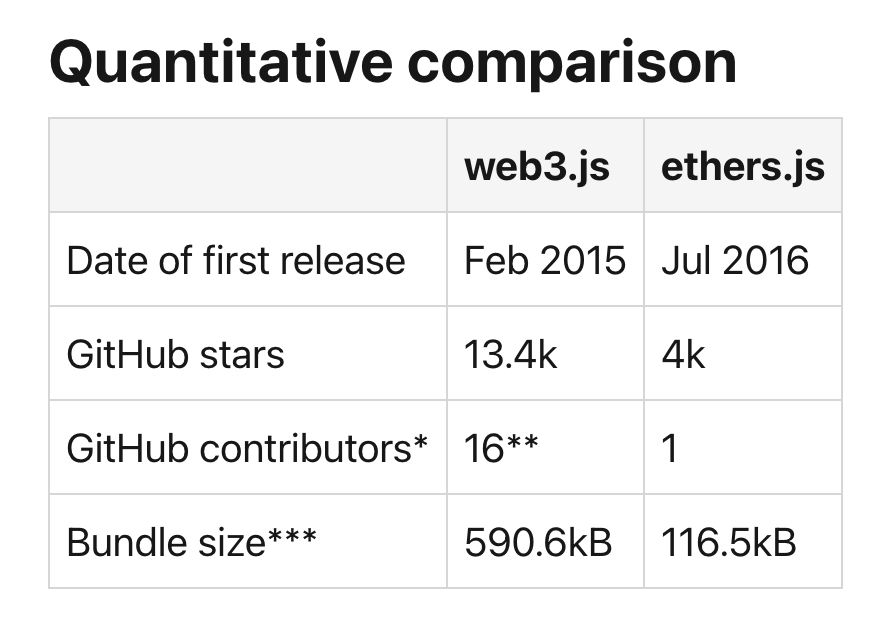

# `Web3.js`

[web3.js - Ethereum JavaScript API - web3.js 1.0.0 documentation](https://web3js.readthedocs.io/en/v1.8.0/)

## 소개글

web3.js는 JSON RPC 프로토콜을 사용하여 로컬 또는 원격 이더리움 노드와 상호 작용할 수 있는 라이브러리 모음입니다.

- JSON RPC란?
    <aside>
    💡 JSON RPC란?
    JSON으로 인코딩된 원격 프로시저 호출입니다. 매우 간단한 프로토콜([XML-RPC](https://ko.wikipedia.org/wiki/XML-RPC)
    와 매우 흡사함)로서, 소량의 데이터 타입과 명령들만을 정의하고 있습니다.
    
    </aside>
    
    ### ****TCP 위에서 동작한다****
    
    HTTP 프로토콜(REST)과 다르게 TCP 위에서 동작하기 때문에 좀 더 다양한 프로토콜에서 활용될 수 있습니다.
    
    [왜 JSON-RPC를 사용할까? - Real Insight Comes From Fixing Error](https://www.getoutsidedoor.com/2019/08/10/%EC%99%9C-json-rpc%EB%A5%BC-%EC%82%AC%EC%9A%A9%ED%95%A0%EA%B9%8C/)

노드 서버에서 접속하는 엔드포인트는 `Infura` 등을 통해 HTTP, IPC 또는 WebSocket를 지원합니다.

웹 브라우저 환경에서는 지갑 객체를 연결해 사용합니다. ex) MetaMask, WalletConnect 등

## module structure

1. web3-eth :
   web3.js 사용자가 이더리움 블록체인과 상호 작용할 수 있는 기능이 포함되어 있습니다.
   ex) 스마트 계약, 외부 소유 계정, 노드, 채굴된 블록 및 트랜잭션과 상호 작용
2. web3-net :
   이더리움 노드의 네트워크 속성과 상호 작용할 수 있습니다.
3. web3-utils :
   이더리움 dapp 및 다른 web3.js 모듈 내에서 사용할 수 있는 유틸리티 기능을 제공

## 구현 방식 및 코드 예시

1. 프로바이더 생성 방식 및 메타마스크 연결

```tsx
// default
window.ethereum.request({ method: "eth_requestAccounts" });
web3 = new Web3(window.ethereum);

// react
function getLibrary(provider: any) {
	const library = new Web3Provider(provider);
	library.pollingInterval = 8000;
	return library;
}

export default function App() {
	return (
		<Web3ReactProvider getLibrary={getLibrary}>
			<MyComponent />
		</Web3ReactProvider>
	);
}
```

1. 컨트랙트 생성 방식

```tsx
const getSale = (networkId: number) => {
	if (!web3) return;
	const saleJSON = require("../contracts/SaleToken.json");
	const abi: AbiItem = saleJSON.abi;
	const ca: string = saleJSON.networks[networkId].address;
	const instance = new web3.eth.Contract(abi, ca);
	setSaleContract(instance);
};
```

1. 메소드 호출 방식

```tsx
myContract.methods
.minting(123)
.send({from: '0xde0B295669a9FD93d5F28D9Ec85E40f4cb697BAe'})
.then(function(result){
    ...
});
```

## 장점

- 기존 caver.js가 양식을 그대로 받아왔기 때문에 현재 소스코드와 유사해 러닝커브가 낮습니다.
- 2015년부터 사용되었으며 많은 프로젝트에서 광범위하게 사용되었습니다.

[https://github.com/Uniswap/web3-react](https://github.com/Uniswap/web3-react)

- dApp + react 개발을 도와주는 4.4k star의 라이브러리가 존재하며 레퍼런스 또한 많습니다.

---

# `ethers.js`

## 소개글

[Documentation](https://docs.ethers.io/v5/)

이더리움 블록체인 및 해당 생태계와 상호 작용하기 위한 완전하고 컴팩트한 라이브러리입니다. web3.js 이후 나온 최신 라이브러리입니다.

## module structure

1. Ethers.provider :
   이더리움 블록체인에 대한 연결을 추상화할 수 있습니다. 쿼리를 발행하고 블록체인 상태를 변경할 서명된 트랜잭션을 보내는 데 사용할 수 있습니다.
2. Ethers.contract :
   스마트 계약을 배포하고 상호 작용할 수 있습니다. 특히 이 모듈의 기능을 사용하면 스마트 계약에서 발생하는 이벤트를 수신하고, 스마트 계약에서 제공하는 함수를 호출하고, 스마트 계약에 대한 정보를 얻고, 스마트 계약을 배포할 수 있습니다.
3. Ethers.utils :
   데이터 형식 지정 및 사용자 입력 처리를 위한 유틸리티 기능을 제공
4. `Ethers.wallets` :
   기존 지갑(이더리움 주소)에 연결하고 새 지갑을 만들고 트랜잭션에 서명할 수 있습니다. 계정을 생성하거나 잔액 체크 가능

## 구현 방식 및 코드 예시

1. 프로바이더 생성 방식 및 메타마스크 연결

```tsx
const provider = new ethers.providers.Web3Provider(window.ethereum);
const signer = provider.getSigner();
```

1. 컨트랙트 생성 방식

```tsx
const createContract = async (providerOrSigner: Web3Provider | Signer) => {
	const tempContract = new ethers.Contract(
		CONTRACT_ADDRESS,
		CONTRACT_ABI,
		providerOrSigner
	);
};
```

Provider는 지갑 및 블록체인 네트워크 객체 / Signer는 앞으로 컨트랙트의 트랜잭션을 서명할 주소 객체입니다.

1. 메소드 호출 방식

```tsx
const call = () => {
	return Contract.test1();
};
```

web3.js와 다르게 call, send 메소드를 호출하지 않아도 알아서 처리해줍니다.

## 장점

[Announcing ethers.js - a web3 alternative](https://medium.com/l4-media/announcing-ethers-js-a-web3-alternative-6f134fdd06f3)

- **초소형** (~88kb 압축, 284kb 비압축)
- 정의 파일 및 전체 TypeScript 소스와 함께 완전한 **TypeScript 준비**
- 잘 되어있는 공식문서
- 좀 더 간결한 사용 방식 (DX: 개발자 사용 경험)

[GitHub - wagmi-dev/wagmi: React Hooks for Ethereum](https://github.com/wagmi-dev/wagmi)

- ethers 기반의 Start 3.k 이상의 최신 라이브러리 또한 존재합니다.
