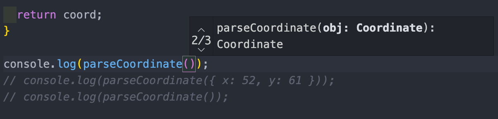

# parameter default

```ts
const addStrings = (str1: string, str2: string = ""): string =>
	`${str1} ${str2}`;
console.log(addStrings("HANKK"));
//
```

상황에 따라 옵셔널로 표시하지말고 확실한 기본값을 주는 것이 결과값에 영향을 안 끼칠 수 있다...

```ts
export const addStrings = (str1: string, str2?: string): string =>
	`${str1} ${str2}`;
console.log(addStrings("HANKK"));
//hakk undefined
```

예상치못한 결과가 나올 수 있다.

<br />

# Record

```ts
const ids: Record<number, string> = {
	10: "a",
	20: "b",
};

ids[30] = "c";
```

<br />

# Runtime vs CompileTime

```ts
export function getName(user: { first: string; last: string }): string {
	return `${user.first} ${user.last}`;
}
console.log(getName());
```

이 파일을 JS로 컴파일하고 실행하면 런타임에서 이런 에러를 확인할 수 있다.

```js
function getName(user) {
	return "".concat(user.first, " ").concat(user.last);
}
//  Cannot read properties of undefined (reading 'first')
```

타입스크립트는 결국 자바스크립트이기때문에 런타임에서 생기는 에러는 잡을 수 없다.

```ts
export function getName(user: { first: string; last: string }): string {
	return `${user?.first ?? "first"} ${user?.last ?? "last"}`;
}
```

<br/>

# 함수 리턴

```ts
export type AdderFunction = (v: number) => number;

export function createAdder(num: number): AdderFunction {
	return (val: number) => num + val;
}

const addOne = createAdder(1);
// addOne: AdderFunction

console.log(addOne(55));
```

함수가 함수를 리턴할 때도 타이핑해준다.

<br />

# 함수 overloading

함수 오버로딩은 객체지향 언어에서 기본적인 사양이라고 합니다.

같은 이름의 함수(함수는 매우 포괄적이며 클래스, 객체 등까지 포함될 수 있습니다.)를 매개 변수가 다르게 설정하여 어떤 함수를 호출할지 인자를 기준으로 판단하는 것인데요.

이제는 매개 변수의 개수, 리턴 타입 등등 모두 다르게 적용해도 사용할 수 있습니다.

궁극적으로는 함수 오버로딩을 통해서 기존의 함수 정의와 완전히 다른 정의를 사용할 수 있습니다.

    객체 지향 프로그래밍에서는 제네릭 문법을 기본적으로 지원합니다. 그러나 언어에 따라 어떠한 클래스
    및 인터페이스도 상속받지 않는 기본 자료형들이 필요할 수 있습니다.
    예를 들어 TS에서는 DOM, React 등 이러한 기본 자료형들, 특수 자료형들을 구분하기 위한 함수
    오버로딩이 필요하며 이러한 오버로딩이 같은 이름을 사용하여야 제네릭 및 템플릿에서 동일한
    함수 이름으로 형식을 식별할 수 있습니다.
    결국 사용자의 편의를 위한 게 아니라 컴파일러의 특성상 생긴 개념이라고 생각하면 될 것 같습니다.

TypeScript에서는 같은 이름을 가진 함수를 여러 개 정의할 수 있으며 각 함수는 서로 다른 타입을 가지는 매개변수로 정의해야 합니다.

매개변수가 다르며 이름이 동일한 함수를 함수 오버로딩이라고 합니다

```ts
// 함수들의 리턴 타입이나 매개변수를 선언해놓는다.
function parseCoordinate(str: string): Coordinate;
function parseCoordinate(obj: Coordinate): Coordinate;
function parseCoordinate(x: number, y: number): Coordinate;

// 여기서는 저 함수들을 아우르는 함수를 구현해야 합니다.
function parseCoordinate(arg1: unknown, arg2?: unknown): Coordinate {
	let coord: Coordinate = {
		x: 0,
		y: 0,
	};
	if (typeof arg1 === "string") {
		(arg1 as string).split(",").forEach((str) => {
			const [key, value] = str.split(":");
			coord[key as "x" | "y"] = parseInt(value, 10);
		});
	} else if (typeof arg1 === "object") {
		coord = {
			...(arg1 as Coordinate),
		};
	} else {
		coord = {
			x: arg1 as number,
			y: arg2 as number,
		};
	}

	return coord;
}

console.log(parseCoordinate("x:12,y:35"));
console.log(parseCoordinate(12, 34));
console.log(parseCoordinate({ x: 52, y: 61 }));
```

```ts
function parseCoordinate(str: string): Coordinate (+2 overloads)
```


